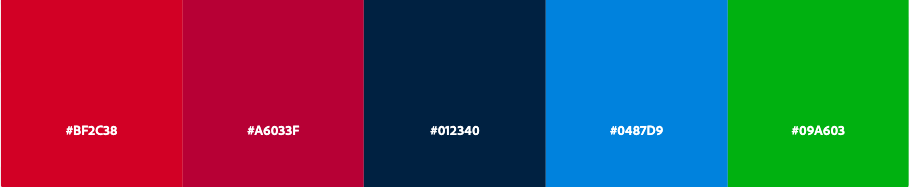
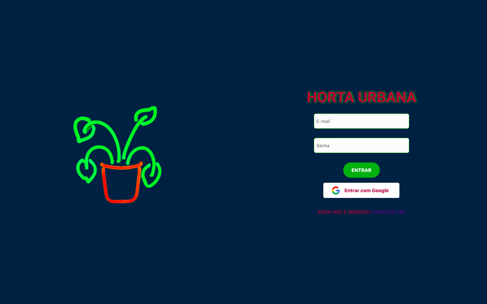
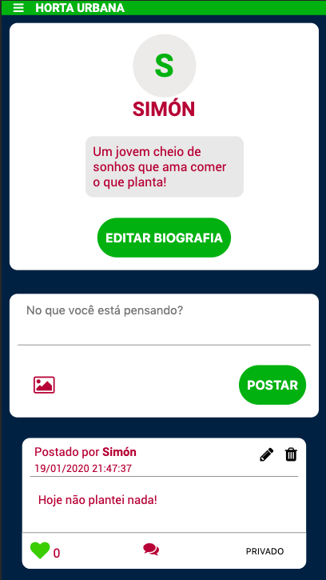

# SOCIAL NETWORK - HORTA URBANA

"Social Network" refere-se ao projeto desenvolvido durante o bootcamp da Laboratória, que tinha por objetivo a construção de uma Rede Social, Single-Page Application (SPA), responsiva na qual fosse possível escrever, ler, atualizar e deletar dados.

***
## Índice
1. [Resumo do Projeto](#1-resumo-do-projeto)
2. [Desenvolvimento do Produto](#2-desenvolvimento-do-produto)
3. [Informações Adicionais](#3-informações-adicionais)
***

# 1. Resumo do Projeto 

A rede social "Horta Urbana" foi desenvolvida para promover a interação entre pessoas que estejam interessadas em compartilhar informações sobre hortas e pequenos plantios no ambiente urbano.

### Paleta de Cores

A paleta de cores utilizada foi inspirada em um ambiente noturno urbano.

***

## 2. Desenvolvimento do Projeto
Este projeto foi desenvolvido em 3 semanas, desde o planejamento inicial, até a entrega do MVP, V1.

 - Primeiro sprint: foram criadas, a tela de login e a página de cadastro.
- Segundo sprint o feed e suas funcionalidades foram implementados (post, CRUD, implementação de hora e nome dos usuários).
- Terceiro sprint implementamos a privacidade dos posts, página de perfil e edição da biografia, post de fotos e a opção de deletar um comentário feito.

**Definição de pronto utilizada:** entrega das tarefas com o layout finalizado, o teste de usabilidade feito e código aceito na master por todas as integrantes.

### Personas
Partindo da proposta da criação de uma rede social foi criada a seguinte persona:  
  Nome: Bárbara
  Profissão:  Estudante de Engenharia Ambiental
  Idade: 25 anos
  Genêro: Feminino
  Mídias: Instagram, WhatsApp e LinkedIn

  Objetivos:
  Bárbara tem como objetivo compartilhar conhecimentos adquiridos na faculdade e impactar positivamente as metrópoles, que são as áreas mais afetadas devido as poucas áreas verdes e excesso de agrotóxicos nos alimentos. Também gostaria construir e adquirir conhecimentos de como cuidar de uma horta e assim obter seus próprios alimentos (orgânicos) e ter uma alimentação mais saúdavel. 
  
  Desafios: Construir uma plataforma que conecta pessoas com os mesmos interesses da Bárbara e proporcione o intercâmbio de informações, ideias e a permuta de sementes e mudas. 
  
  Como esta Rede Social pode ajudá-la? Com a "Horta Urbana" é possível compartilhar como dar início a hortas caseiras para quem ainda não começou, e dicas para os que já estão familiarizados com esses hábitos! 

### Histórias de Usuário

Esta aplicação é uma Rede Social onde o usuário pode ingressar criando uma conta na aplicação ou por meio de uma conta Google. Ao fazer login o usuário pode postar suas ideias, perguntas e interagir com outros usuários ao ler posts e por meio de comentários. 
O usuário tem poder de criar, editar e deletar suas postagens e comentar e "dar like" nos posts dos demais usuários. 
Na página de "Meu Perfil" o usuário consegue editar suas informações pessoais e visualizar todas as suas postagens. No "Feed" o usuário visualiza as postagens dos demais usuários cadastrados com os quais pode interagir.

As funcionalidades foram designadas com as seguintes demandas do usuário.
- Como usuário novo é possível: 
    - criar uma conta com email e senha válidos para poder iniciar uma sessão e ingressar na Rede Social.
    - ter a opção de iniciar sessão com uma conta Google para ingressar na Rede Social sem necessidade de criar uma conta de email válido (Figura 1).

    

    

    **Figura 1.** Interface inicial da Rede Social - Horta Urbana.

- Como usuário logado é possível: 
    - criar, guardar, modificar no mesmo lugar (in place) e deletar publicações (post) privadas ou públicas.
    - ver todos os posts públicos e seus posts privados criados até o momento, do mais recente para o mais antigo, assim como a opção de trocar a configuração de privacidade dos posts.
    - dar like e ver a contagem de likes nas publicações.
    - escrever, salvar e deletar seus comentários feitos.
    - postar fotos (GIFs demostrativos).
    - visualizar os dados do perfil criado e editá-los (Figura 2).

**GIFs demostrativos das funcionalidades**

**Figura 2.** Interface do perfil do usúario.

***
# 3. Informações Adicionais
Este projeto foi proposto pela Laboratória BR e  desenvolvido em conjunto com as alunas Giovanna Lima, Juanita Solano e Mônica Sousa.
